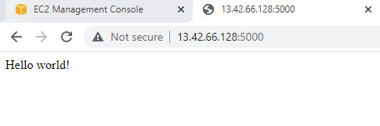

# Docker

### Introduction Tutorial
 - Give Docker a go by running a hello world container using the docker run command:

 ``` docker run --rm hello-world ```


<hr>

### Images Tutorial
 - Firts, register an account with Dockerhub 
 - Authenticate the docker CLI to Dockerhub with the 
 login command 
 ``` docker login ```

 - Download the oficcial Java image 
 ``` docker search Java ```

 - The search command returns a table of images relevant to the search term with their description and wether they are official image
 - User the docker pull command to download the java image
 ``` docker pull openjdk ``` 
 - Replace <your_docker_username> with your Docker username and run the following command:
 ``` docker tag java <your_docker_username>/java:7 ```

 - Now, when we run docker images, we can see two images. We have created a new image with a different name

 

- Now we can push the newly tagged image to our repository by tagging it in the format [USERNAME]/[IMAGE]:[TAG]

``` docker push <your_docker_username>/java:7 ```

- Navigate to Dockerhub, and you should see a new repository

 

 - Now that the image has been uploaded, we can delete the images we have locally and free up space.

 ``` docker rmi java ```

 - Repeat for the renamed image
 
 ```docker rmi <your_docker_username>/java:7```

 <hr>

 ### Containers Tutotial

 Setting up a Jenkins instance inside a container:

 - Spin up a container using the official Jenkins image
 - Map port the machine's port 8080 to the container port 8080
 
 ``` docker run -d -p 8080:8080 --name my_jenkins jenkins/jenkins ```

- Check if the container has started properly:

``` docker ps ```

- Retrieve the initial administrator password from the container

``` docker exec my_jenkins cat var/jenkins_home/secrets/initialAdminPassword ```

**d2a90d937877480481456b7d0f76b621**

- Now you have the initial admin password, copy your machine's public IP address and navigate to it in your browser on a new tab. Make sure you have allowed incoming connections on port 8080

http://3.8.190.67:8080/login?from=%2F

- You will be prompted to provide the initial admin password that you retrieved previously. Copy it in and follow the installation instructions to install the plugins

**Tear down**

- Stop the container

``` docker stop jenkins_container ```

- Deletes the container

``` docker rm jenkins_container ```
<hr>

### Dockerfile Tutotial
This exercise will get you to take the NGINX Docker Image and change the default index.html file that is served.
These changes will be packed into your own Docker Image that you can run and view the changes for yourself.

1 - Create a new directory dockerfile_exercises

```
mkdir dockerfile_exercises 
cd dockerfile_exercises 
```

2 - Make a Dockerfile

``` touch Dockerfile ```

3 - Place the following contents within the Dockerfile:
```
FROM nginx:latest
RUN printf "My custom NGINX Image\n" > /usr/share/nginx/html/index.html
```
4 - Build the image from Dockerfile and give the new image name _ournginx_
```
docker build -t ourginx .
```
5 - Run ournginx image on port 80:
```
docker run -d -p 80:80 --name nginx ourginx
```


6 - Stop and remove the container
```
docker stop nginx
docker rm nginx
```
7 - Remove the ourginx image 
```
docker rmi ourginx
```
<hr>

### Dockerfile Instructions Tutorial

For this tutorial, we will create an image for a simple Flask app to be ran in a container.

1 - create a directory called myapp with a file named app.py
```
mkdir myapp
cd myapp
touch app.py
```
2 - In app.py, enter the following code:
```
from flask import Flask
app = Flask(__name__)

@app.route('/home')
@app.route('/')
def home():
    return "Hello world!"

if __name__ == '__main__':
    app.run(port=5000, host='0.0.0.0', debug=True)
```
3 - Create the Dockerfile to build an image
```
touch Dockerfile
```
4 - Paste the instructions in the dockerfile:
```
# Python base image.
FROM python:3.7
# Create and set the work directory inside the image named 'app'
WORKDIR /app
# Execute a pip install command using the list 'requirements.txt'
RUN pip install Flask
# Copy the app file into the image working directory
COPY app.py .
# State the listening port for the container. 
# The app's code does not actually specify the port, so it would be useful to include here.
EXPOSE 5000
# Run 'python app.py' on container start-up. This is the main process.
ENTRYPOINT ["python", "app.py"]
```

5- Build the image
```
docker build -t myapp_image .
```
6 - Run a container from the image:
```
docker run -d -p 5000:5000 --name myapp myapp_image 
```
7 - Navigate to the app [IP_ADDRESS]:5000 to check



8 - Teardown
```
# stop container
docker stop myapp
# remove container
docker rm myapp
# remove image
docker rmi myapp_image
```
### Dockerignore Tutorial
1 - Create a new directory called ignore_exercise
```
mkdir ignore_exercise
cd ignore_exercise
```
2 - Create Dockerfile
```
touch Dockerfile
```
3 - Place the following contents into the Dockerfile:
```
# build from the latest alpine image
FROM alpine:latest
# copy everything from the context to the container
COPY . /context
# display everything that has been copied to the container
RUN ls -al /context
```
4 - Create project files
 - Create a directory called docs and files named app.py, my-notes.md and README.md.
 ```
 mkdir docs 
 cd docs
 touch app.py my-notes.md README.md
 ```
 

5 - Create .dockerignore file
- We do not want to copy any internal documentation, so we will use the .dockerignore file to exclude them.
```
touch .dockerignore
```
6 - Place the following contents into the .dockerignore file:
```
# ignore the docs folder
docs
# ignore all markdown files
*.md
# in this case, we can make an exception for the README
!README.md
```
7 - Build the image
```
docker build -t my-image:latest .
```


8 - Remove the image
```
docker rmi my-image alpine
```
### Multi-stage build Tutorial

### Networking Tutorial 
This tutorial shows you how to create a bridge network and connect a containerised Python HTTP server and an NGINX container to a network.

NGINX will run as a reverse proxy, redirecting traffic on port 80 to the Python container that is published to port 9000. The bridge network will allow this connection to take place.

1- Create a new directory called docker_networking_tutorial and change to this directory:
```
mkdir docker_networking_tutorial && cd $_
```
2 - Create a New Bridge Network to allow the application and NGINX container to connect to one another
```
docker network create my-network
```
3 - Create an Application Container
Run a simple Python-based HTTP server container that is based on the image bobcrutchley/python-http-server:latest. Name the container _server_ and connect it to the new network with the --network flag.
```
docker run -d --network my-network --name server bobcrutchley/python-http-server:latest
```
4 - Create an NGINX Container
Create an NGINX container with custom configuration and connect it to our network
```
docker run -d --network my-network -p 80:80 --name nginx lukebenson1/docker-networking-nginx:latest
```
5 - Access the application:
- using the command curl localhost


- navigating to your VM's external IP address via your browser


6 - Stop the container
```
docker rm -f server nginx
```
7 - Remove images
```
docker rmi lukebenson1/docker-networking-nginx:latest bobcrutchley/python-http-server:latest
```
### Duo Task Tutorial 
This exercise gets you to containerise a basic Flask application and use NGINX as a reverse proxy.

1 - Containerise the Flask application from GitLab repo
```
 git clone https://gitlab.com/qacdevops/duo-task.git duo_task
```
2 - Write a Dockerfile to build the image 
```
# Use Python 3.6 or later as a base image
FROM python:3.6
# Copy contents into image
COPY . .
# Install pip dependencies from requirements
RUN pip install -r requirements.txt
# Set YOUR_NAME environment variable
ARG YOUR_NAME="Cristiana"
# Expose the correct port
EXPOSE 5500
# Create an entrypoint
ENTRYPOINT ["python", "app.py"]
```
```
docker build -t app-image . 
```
3 - Create a network and connect the Flask app container to it
```
docker run -d --network app-network --name app-server app-image
```
4 - Create an NGINX container and connect it to the network
- You will need to either bind mount the nginx.conf file to /etc/nginx/nginx.conf on the container, or create a custom NGINX image which copys the file there instead.
```
```


